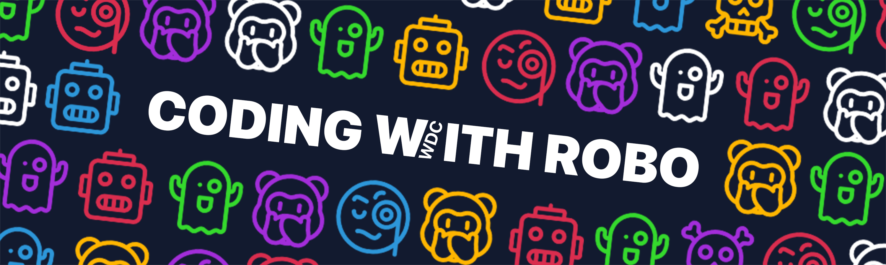
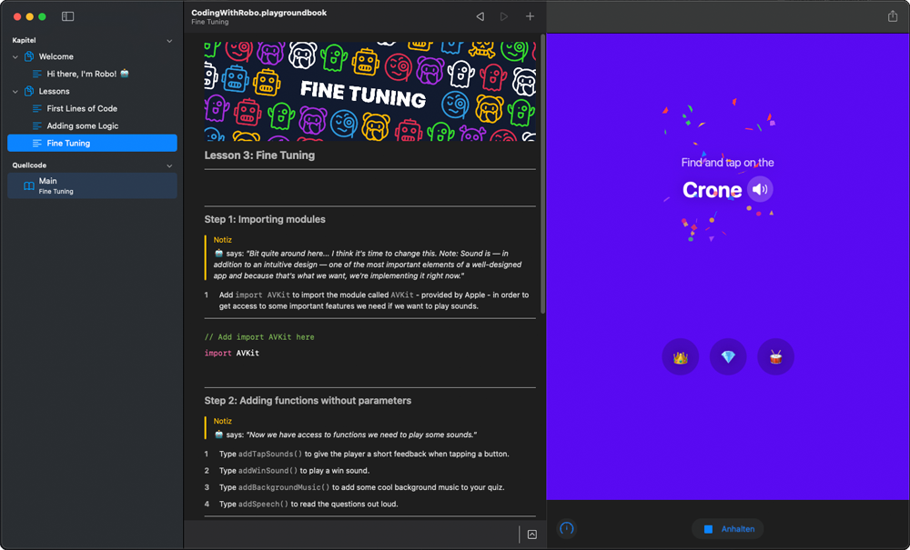

# Coding with Robo
### Swift Student Challenge

---

## About My Submission
### 1. General
**To keep it short:** _Coding with Robo_ is a Swift Playground that playfully introduces you to the basics of Swift and SwiftUI by programming a mini-quiz in less than three minutes.

**Longer:** As a student, I am steadily looking for new challenges and am always open for something new. This was also the case about half a year ago, when I got into app development through an internship. At that time, still completely inexperienced, I taught myself Swift and SwiftUI by watching videos, reading books and learning from experienced developers. In such a short period of time, app development has grabbed me so much that I now want to motivate more people to start programming. With just a few lines of code and a small amount of time you can already achieve great things! And the first step in the right direction is called `Coding with Robo` 😉.

### 2. Usability & Accessibility Support
This playground is designed to be used by a wide variety of people, so the following accessibility features were considered:
* **Responsive design** for optimal support of both small and large devices
* **Text to Speech** in the respective national language
* Swift Playground running on **iPadOS** and **macOS**

### 3. Used Technologies
* SwiftUI
* PlaygroundSupport
* AVKit

### 4. System Requirements
_Developed with_
* Xcode 12.4 with Swift 5.3.2 on macOS 11.2.3

_Tested with_
* Swift Playgrounds 3.4.1 on iPadOS 14.4.2
* Swift Playgrounds 3.4.1 on macOS 11.2.3

### 5. Sneak Peek
 

---

## License
Distributed under the MIT License. See `LICENSE` for more information.
